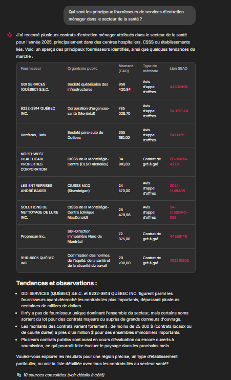

# 🏗️ SEAO RAG Assistant

Un système intelligent de **Retrieval-Augmented Generation (RAG)** permettant d'interroger en langage naturel une base de données de plus de **300 000 appels d'offres publics** du Québec (SEAO).
*L'assistant répondant à une question complexe avec citation des sources.*


## 📸 Aperçu




[](https://huggingface.co/spaces/Mons999/seao_QA)

> **Testez la démo live ici 👆**

## 🎯 Objectif

Démocratiser l'accès aux données contractuelles publiques. Au lieu d'écrire des requêtes SQL complexes ou de chercher manuellement sur le portail SEAO, l'utilisateur pose des questions comme :
> *"Quels sont les plus gros contrats de déneigement à Montréal en 2023 ?"*

L'assistant répond avec précision, synthèse, et **liens vers les sources officielles**.

## ⚙️ Architecture technique

Le projet est divisé en deux pipelines majeurs :

### 1. Pipeline ETL & indexation (`/etl`)
* **Extraction :** Connexion au Data Warehouse (BigQuery) contenant les données brutes SEAO.
* **Transformation :** Nettoyage, déduplication des appels d'offres (gestion des versions via `ocid`), et templating de texte enrichi.
* **Chargement (Load) :** Génération d'embeddings (via `text-embedding-3-large`) et indexation massive dans **Qdrant**.
* **Volume :** ~300 000 vecteurs de 3072 dimensions.

### 2. Pipeline RAG & zpplication (`/src` & `app.py`)
* **Cerveau (Agent) :** Utilisation de **LangChain** et des **Agents** (`create_tool_calling_agent`) pour orchestrer la recherche.
* **Retrieval :** Recherche hybride sémantique + métadonnées dans Qdrant.
* **Generation :** Synthèse par **GPT-4o**.
* **Interface :** Application interactive via **Streamlit**.

## 🚀 Installation et Démarrage

Ce projet utilise **uv** pour la gestion des dépendances.

### 1. Cloner le dépôt
```bash
git clone [https://github.com/monsif1999/SEAO_QA.git](https://github.com/monsif1999/SEAO_QA.git)
cd SEAO_QA